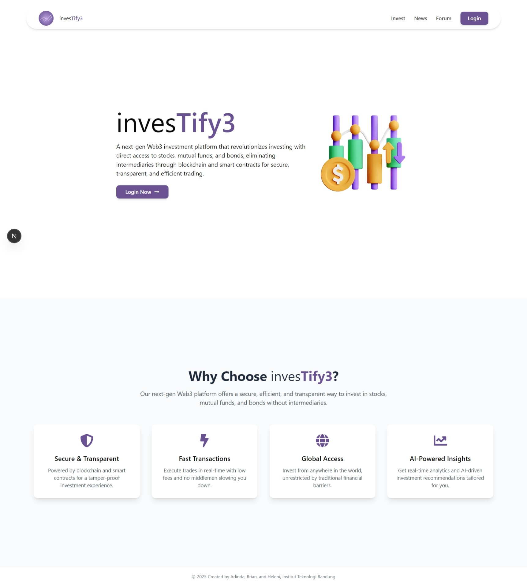

# Investify3

An IC-blockchain-based Investment Web Application



## Description

Investify3 is a next-generation Web3 investment platform that allows users to securely invest in a wide range of assets, including stocks, cryptocurrencies, bonds, and more. Built on the Internet Computer (ICP) blockchain, Investify3 delivers a transparent, decentralized, and highly secure environment, ensuring that investors can manage their portfolios with confidence.

The platform offers comprehensive financial education, practical investment tools, and strong security features to empower young investors in both traditional and digital markets. By combining innovative technology with an emphasis on user safety, Investify3 aims to make investing accessible, informed, and rewarding for everyone.

The website has key features including:
1. **Investment Management** - Tools for expense tracking and investment management.
2. **Stock Analysis** - Provides users with stock market data, investment recommendations, and analytics tools.
3. **Educational Content** - Helps users learn about investments, stock markets, and financial planning.
4. **Community Engagement** - Connect with other users to share insights and discuss financial strategies.

## Made by Investify3 Team
- Adinda Putri
- Heleni Gratia
- Brian Hadian

## Getting Started

### Dependencies

- NodeJS 18.* or higher https://nodejs.org/en/download/
- DFX 15 or higher
- Internet Computer dfx CLI https://internetcomputer.org/docs/current/developer-docs/setup/install/
- Visual Studio Code (Recommended Code Editor) https://code.visualstudio.com/Download
- MetaMask Extension

```bash
sh -ci "$(curl -fsSL https://internetcomputer.org/install.sh)"
```

### Installing

Clone this Git repository on your local device:
```bash
git clone https://github.com/Investify3/hackathon-web3-investify3
```

### Executing Program

1. Open command terminal: Enter the commands to start dfx local server in background:
```bash
cd hackathon-web3-investify3
cd investify3
```

2. Deploying the canister:
```bash
dfx start --background --clean
dfx deploy
```

3. Navigate to the frontend folder, install dependencies, and run the dev server:
```bash
cd hackathon-web3-investify3-frontend
npm install
npm run dev
```

4. The website will usually run on:
http://localhost:3000/

5. Cleanup - stop dfx server running in background:
```bash
dfx stop
```

## MetaMask Setup

Before running the application, make sure MetaMask is installed:
1. Go to the official MetaMask website: [metamask.io](https://metamask.io)
2. Click the `Download` button.
3. Choose your browser and follow the instructions to add the MetaMask extension.
4. Once installed, log in to MetaMask with your wallet credentials.

## Version History
- 0.1
    - Initial Release
